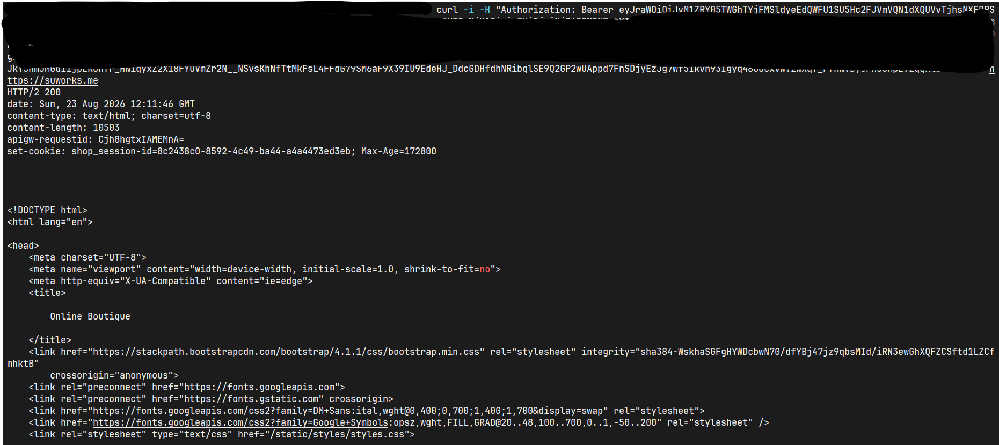
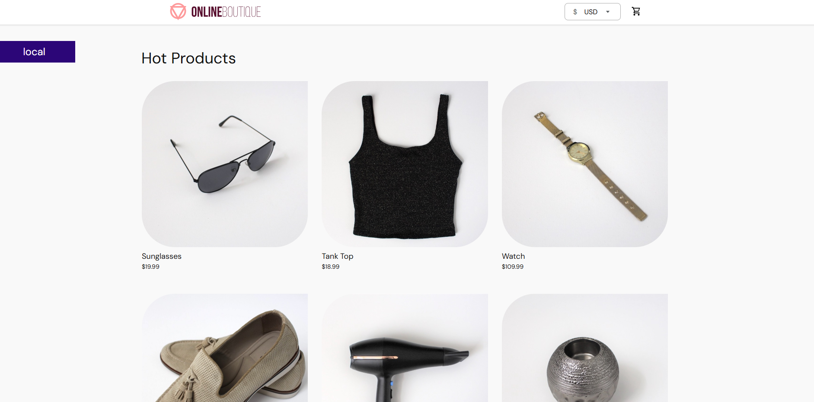
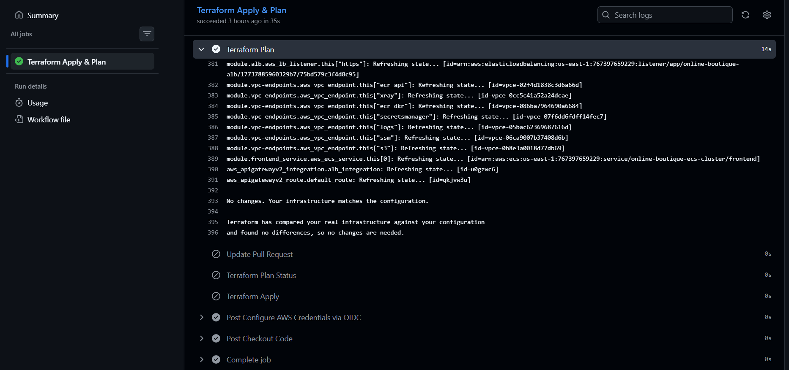

# Zero-Trust Serverless Microservices Platform (AWS Fargate)


[](https://github.com/susu10-10/online-boutique-aaws-pf/actions/workflows/terraform.yml)

[](https://github.com/susu10-10/online-boutique-aaws-pf/actions/workflows/ci.yml)


## What this is

A full re-architecture of the canonical Google Online Boutique microservice demo onto AWS ECS Fargate, provisioned end-to-end with Terraform and delivered through a GitOps CI/CD pipeline that authenticates to AWS via OIDC federation (zero static credentials). The synchronous `checkout`→`email` gRPC call was replaced with an event-driven **SQS → Lambda → SNS** pipeline. This is the AWS-native successor to a previous DigitalOcean deployment (`online-boutique-pf`).

## Impact at a glance

| | |
|---|---|
| **11** microservices on ECS Fargate | **0** public IPs the ALB is `internal = true` in private subnets |
| **0** NAT gateways airgapped private subnets | **7** PrivateLink VPC endpoints for all AWS API egress |
| **1** public ingress API Gateway HTTP + VPC Link | **1** identity Cognito JWT authorizer at the edge |
| **1** async order pipeline SQS → Lambda → SNS | **0** static credentials GitHub OIDC federation |

## Architecture Highlights

- **Zero-Trust Network by design.** Public access to the compute layer is severed: the internal ALB lives in private subnets with no public IPs, and every request passes through a Cognito JWT authorizer at the API Gateway edge before it can even enter the VPC through the VPC Link.
- **Airgapped data plane, no NAT.** Private subnets have no internet route in either direction. All AWS API egress traffic (SSM, ECR, CloudWatch Logs, Secrets Manager, X-Ray) flows strictly through AWS PrivateLink interface endpoints with private DNS; S3 uses a Gateway endpoint. The X-Ray daemon and Redis images were pulled once and mirrored into private ECR so running tasks never touch a public registry, (all ECS Fargate tasks operate within the PrivateLink boundary).
- **Asynchronous Event-driven decoupling.** A synchronous gRPC bottleneck was eliminated. The checkout service now publishes order payloads to an **Amazon SQS Queue**, asynchronously processed by an **AWS Lambda** function, and dispatched via **Amazon SNS**.
- **12-factor configuration.** Hierarchical SSM Parameter Store (`/online-boutique/prod/*`) is injected into containers at runtime via ECS secrets at container boot, with IAM (Task Execution Policies) scoped to the exact parameter path.
- **Observability built in.** X-Ray daemon sidecar on `frontend` (UDP 2000) streams traces through the X-Ray endpoint; container logs ship to CloudWatch Logs both inside the PrivateLink boundary.
- **GitOps, least-privilege IAM.** GitHub Actions assumes a scoped deployment role via OIDC (repo-and-branch pinned, short-lived); separate task execution, task, and Lambda roles each hold only what they need. ECR scan-on-push + Trivy SARIF in CI.

## Verified in production

The deployment was validated end-to-end from the live environment: a Cognito test user was created, `initiate-auth` (`USER_PASSWORD_AUTH`) issued tokens, and the JWT was sent to the API Gateway:




## Architecture diagram

```mermaid
%%{init: {"flowchart": {"htmlLabels": true, "curve": "linear"}, "theme": "base", "themeVariables": {"fontSize": "14px"}} }%%
flowchart TB
    classDef user fill:#FFFFFF,stroke:#202124,stroke-width:2px,color:#202124;
    classDef edge fill:#E8F0FE,stroke:#4285F4,stroke-width:2px,color:#174EA6;
    classDef svc fill:#E6F4EA,stroke:#34A853,stroke-width:2px,color:#137333;
    classDef bridge fill:#FEF7E0,stroke:#F9AB00,stroke-width:2px,color:#B06000;
    classDef endpoint fill:#F3E8FD,stroke:#A142F4,stroke-width:2px,color:#681DA8;

    subgraph Internet["Public Internet"]
        User["Client / Browser"]
    end

    subgraph Edge["AWS Edge Perimeter"]
        direction LR
        R53["Route 53<br/>suworks.me"]
        Cognito["Cognito User Pool<br/>hosted UI + app client"]
        APIGW["API Gateway HTTP<br/>JWT authorizer + TLS 1.2"]
    end

    subgraph VPC["AWS VPC 10.0.0.0/16 — no NAT gateways"]
        subgraph VpcLinkZone["VPC Link (private subnets)"]
            VPCLink["API Gateway VPC Link<br/>boutique-vpc-link ENIs"]
        end
        subgraph PrivateSubnets["Airgapped private subnets"]
            direction LR
            ALB["Internal ALB<br/>HTTPS 443 (ACM) / HTTP 80"]
            subgraph ECS["ECS Fargate — 11 services"]
                direction LR
                FE["frontend :8080<br/>+ xray-daemon :2000 UDP"]
                Cart["cartservice :7070"]
                Catalog["productcatalogservice :3550"]
                Currency["currencyservice :7000"]
                Shipping["shippingservice :50051"]
                Checkout["checkoutservice :5050"]
                Payment["paymentservice :50051"]
                Email["emailservice :50051"]
                Ad["adservice :9555"]
                Rec["recommendationservice :8080"]
                Loadgen["loadgenerator"]
            end
            subgraph Bridge["Async order pipeline"]
                direction LR
                SQS["SQS<br/>online-boutique-orders"]
                Lambda["Lambda<br/>order-processor"]
                SNS["SNS<br/>order-notifications"]
            end
        end
        subgraph Endpoints["AWS PrivateLink — 7 VPC endpoints"]
            direction LR
            S3EP["S3 Gateway"]
            ECRAPI["ECR API"]
            ECRDKR["ECR DKR"]
            LOGS["CloudWatch Logs"]
            SM["Secrets Manager"]
            SSMEP["SSM"]
            XRAYEP["X-Ray"]
        end
    end

    style Internet fill:#F8F9FA,stroke:#DADCE0
    style Edge fill:#F1F3F4,stroke:#DADCE0
    style VPC fill:#FFF8F6,stroke:#EA4335
    style ECS fill:#F2F8F2,stroke:#34A853
    style Bridge fill:#FFF9E6,stroke:#F9AB00
    style Endpoints fill:#F9F0FF,stroke:#A142F4

    User -->|"1 · DNS"| R53
    User -->|"OAuth token"| Cognito
    R53 -->|"route"| APIGW
    APIGW -.->|"2 · validate JWT"| Cognito
    APIGW -->|"3 · VPC Link"| VPCLink
    VPCLink -->|"4 · private route"| ALB
    ALB -->|"5 · / → :8080"| FE
    FE <-->|"5 · gRPC mesh"| Cart
    FE <-->|"5 · gRPC mesh"| Catalog
    FE <-->|"5 · gRPC mesh"| Currency
    FE <-->|"5 · gRPC mesh"| Shipping
    FE <-->|"5 · gRPC mesh"| Checkout
    FE <-->|"5 · gRPC mesh"| Ad
    FE <-->|"5 · gRPC mesh"| Rec
    Loadgen -.->|"synthetic load"| FE
    Checkout -->|"6 · enqueue order"| SQS
    SQS -->|"7 · event source mapping"| Lambda
    Lambda -->|"8 · publish email"| SNS
    FE -.->|"9 · UDP traces"| XRAYEP
    FE -.->|"9 · config (SSM)"| SSMEP
    FE -.->|"9 · image pulls (ECR)"| ECRDKR
    class User user;
    class R53,Cognito,APIGW,VPCLink,ALB edge;
    class FE,Cart,Catalog,Currency,Shipping,Checkout,Payment,Email,Ad,Rec,Loadgen svc;
    class SQS,Lambda,SNS bridge;
    class S3EP,ECRAPI,ECRDKR,LOGS,SM,SSMEP,XRAYEP endpoint;
```



## Repository layout

```text
online-boutique-aws-pf/
├── .github/workflows/
│   ├── terraform.yml          # OIDC auth, fmt-check, init, plan, apply
│   └── ci.yml                 # image matrix: build, push ECR, Trivy SARIF
├── infrastructure/envs/prod/
│   ├── backend.tf             # S3 state, encrypted + locked
│   ├── 01_vpc.tf … 14_cognito_gw.tf
│   └── lambda_function.py     # SQS → SNS order processor
├── src/                       # 11 microservice sources (Online Boutique)
└── docs/
    └── ARCHITECTURE.md        # deep-dive: design, security, CI/CD, ops
```

## Quickstart & Deployment

> Note: The `.`tf files in this public repository contain sanitized [redacted] placeholders for sensitive ARNs and variables. Real values are managed via AWS SSM and GitHub Secrets

```console
git clone [https://github.com/susu10-10/online-boutique-aaws-pf.git](https://github.com/susu10-10/online-boutique-aaws-pf.git)
cd online-boutique-aaws-pf/infrastructure/envs/prod

# Initialize Terraform with S3 backend
terraform init

# Review infrastructure state graph
terraform plan

# Deploy infrastructure
terraform apply
```

CI/CD runs from the GitHub UI (`workflow_dispatch`), authenticating via **OIDC no static AWS keys anywhere**. 

## Deep Dive Documentation

For a comprehensive breakdown of the networking, threat model, and observability patterns used in this deployment, see the [Architecture & Security Deep Dive](docs/ARCHITECTURE.md).


## Screenshots





---

Built with **Terraform · GitHub Actions OIDC · ECS Fargate · API Gateway · Cognito · SQS / Lambda / SNS · X-Ray · SSM Parameter Store**.
