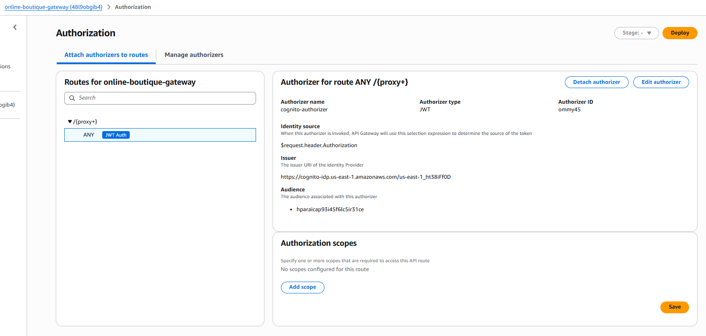
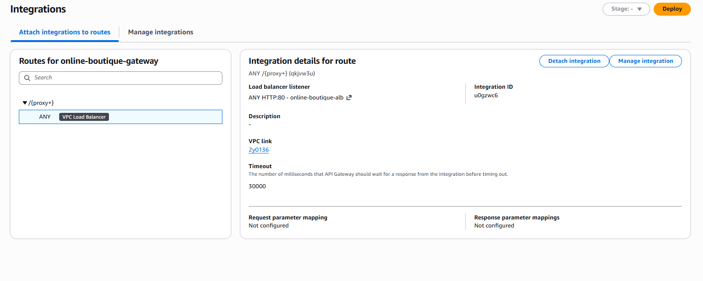
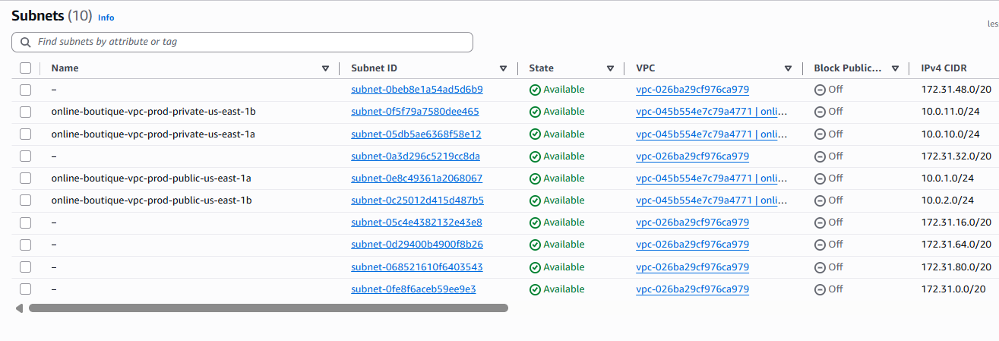
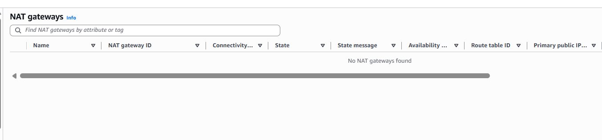
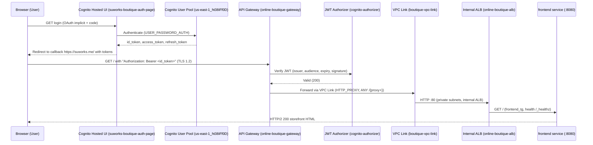

# Architecture & Security Deep Dive: Online Boutique on AWS

This document details the engineering decisions, threat models, and operational configurations for the Zero-Trust Online Boutique platform.


## 1. Overview

| Asset | Threat | Mitigating Control |
|---|---|---|
| **Compute Layer (Fargate)** | Direct internet access, port scanning | Internal ALB + private subnets. No public IPs exist on compute nodes. Security Group ingress restricted strictly to the ALB. |
| **Public API Edge** | Unauthenticated access, token forgery | API Gateway edge with Cognito JWT Authorizer. Missing or invalid tokens are dropped before entering the VPC. TLS 1.2 enforced. |
| **Data Plane / Egress** | Data exfiltration, reverse shells | **Zero NAT Gateways.** Subnets are fully airgapped. AWS API traffic (SSM, ECR, CloudWatch) flows exclusively via AWS PrivateLink endpoints. |
| **CI/CD Pipeline** | Stolen static IAM credentials | GitHub Actions uses OpenID Connect (OIDC) to assume short-lived, strictly scoped IAM roles. |

## Design principles

Google Online Boutique is the canonical microservices reference application (gRPC mesh, 11 services). This project rebuilds it as a production-hardened AWS platform and is the AWS-native successor to a prior DigitalOcean deployment (`online-boutique-pf`). Every resource is Terraform-managed, every deployment credential is short-lived (GitHub OIDC), and the Asynchronous checkout→email gRPC call was replaced with an event-driven SQS → Lambda → SNS pipeline.

- **Zero-Trust networking, no public compute.** The ALB is `internal = true` in private subnets. No task, container, or instance has a public IP. The only public surface in the platform is the API Gateway HTTP API.
- **Single authenticated edge.** API Gateway v2 validates a Cognito JWT before any traffic enters the VPC. Requests without a valid token never reach the ALB.
- **No NAT gateways.** Private subnets have no internet route in either direction. All AWS API egress flows through 7 PrivateLink endpoints; image pulls and config fetches use interface endpoints with private DNS.
- **Event-driven decoupling.** Checkout publishes order payloads to SQS; Lambda processes them; SNS delivers email. Checkout never blocks on email delivery.
- **12-factor configuration.** Runtime config lives in hierarchical SSM Parameter Store entries (`/online-boutique/prod/{global,service}/*`) injected at container start via the ECS secrets block, with IAM scoped to the exact parameter path.
- **Least-privilege IAM.** Separate deployment, task execution, task, and Lambda roles each scoped to minimal actions and resources.
- **Observability by default.** X-Ray daemon sidecar on the frontend, CloudWatch Logs shipping all telemetry egresses through PrivateLink.
- **IaC with verified convergence.** Terraform with an S3 state backend (encrypted, locked); the final apply reported **"No changes infrastructure matches configuration"**.


## 2. System diagram

```mermaid
%%{init: {"flowchart": {"htmlLabels": true, "curve": "linear"}, "theme": "base", "themeVariables": {"fontSize": "14px"}} }%%
flowchart TB

    classDef internet fill:#F8F9FA,stroke:#5F6368,stroke-width:2px,color:#202124;
    classDef edge fill:#E8F0FE,stroke:#4285F4,stroke-width:2px,color:#174EA6;
    classDef svc fill:#E6F4EA,stroke:#34A853,stroke-width:2px,color:#137333;
    classDef bridge fill:#FEF7E0,stroke:#F9AB00,stroke-width:2px,color:#B06000;
    classDef endpoint fill:#F3E8FD,stroke:#A142F4,stroke-width:2px,color:#681DA8;
    classDef config fill:#E8F0FE,stroke:#4285F4,stroke-width:1px,color:#174EA6;

    subgraph Internet["Public Internet"]
        User["Client / Browser"]
    end

    subgraph Edge["AWS Edge — DNS · Auth · TLS"]
        direction LR
        R53["Route 53<br/>suworks.me zone Z09119203ES24GTLS3WTL"]
        Cognito["Cognito User Pool<br/>us-east-1_ht38iFf0D<br/>hosted UI"]
        APIGW["API Gateway HTTP<br/>48l9obgib4<br/>JWT authorizer · TLS 1.2"]
    end

    subgraph VPC["VPC 10.0.0.0/16 — no NAT gateways"]
        direction TB

        subgraph VpcLinkZone["VPC Link — private subnets"]
            VPCLink["boutique-vpc-link ENIs"]
        end

        subgraph PrivateSubnets["Private subnets 10.0.10.0/24 · 10.0.11.0/24"]
            direction LR

            ALB["Internal ALB online-boutique-alb<br/>HTTPS 443 (ACM) / HTTP 80"]

            subgraph ECS["ECS Fargate cluster — Cloud Map namespace onlineboutique.internal"]
                direction LR
                FE["frontend :8080<br/>cpu 256 · mem 512"]
                XRayDaemon["xray-daemon :2000 UDP"]
                Cart["cartservice :7070"]
                Catalog["productcatalogservice :3550"]
                Currency["currencyservice :7000"]
                Shipping["shippingservice :50051"]
                Checkout["checkoutservice :5050"]
                Payment["paymentservice :50051"]
                Email["emailservice :50051"]
                Rec["recommendationservice :8080"]
                Ad["adservice :9555"]
                Loadgen["loadgenerator"]
            end

            subgraph Bridge["Async order pipeline"]
                direction LR
                SQS["SQS online-boutique-orders"]
                Lambda["Lambda order-processor"]
                SNS["SNS order-notifications"]
            end
        end

        subgraph Endpoints["PrivateLink — 7 VPC endpoints"]
            direction LR
            S3EP["S3 (Gateway)"]
            ECRAPI["ECR API"]
            ECRDKR["ECR DKR"]
            LOGS["CloudWatch Logs"]
            SM["Secrets Manager"]
            SSMEP["SSM"]
            XRAYEP["X-Ray"]
        end
    end

    SSMParams["SSM Parameter Store<br/>/online-boutique/prod/*"]

    style Internet fill:#F8F9FA,stroke:#DADCE0
    style Edge fill:#F1F3F4,stroke:#DADCE0
    style VPC fill:#FFF8F6,stroke:#EA4335
    style ECS fill:#F2F8F2,stroke:#34A853
    style Bridge fill:#FFF9E6,stroke:#F9AB00
    style Endpoints fill:#F9F0FF,stroke:#A142F4

    User -->|"1 · DNS + TLS"| R53
    User -->|"OAuth token"| Cognito
    R53 -->|"route"| APIGW
    APIGW -.->|"2 · validate JWT"| Cognito
    APIGW -->|"3 · VPC Link"| VPCLink
    VPCLink -->|"4 · private route"| ALB
    ALB -->|"5 · / → :8080"| FE

    FE <-->|"5 · gRPC mesh"| Cart
    FE <-->|"5 · gRPC mesh"| Catalog
    FE <-->|"5 · gRPC mesh"| Currency
    FE <-->|"5 · gRPC mesh"| Shipping
    FE <-->|"5 · gRPC mesh"| Checkout
    FE <-->|"5 · gRPC mesh"| Payment
    FE <-->|"5 · gRPC mesh"| Email
    FE <-->|"5 · gRPC mesh"| Rec
    FE <-->|"5 · gRPC mesh"| Ad
    Loadgen -.->|"synthetic load"| FE

    Checkout -->|"6 · enqueue order"| SQS
    SQS -->|"7 · event source mapping"| Lambda
    Lambda -->|"8 · publish email"| SNS

    FE -.->|"9 · UDP traces"| XRayDaemon
    XRayDaemon -->|"9 · telemetry"| XRAYEP
    FE -.->|"9 · logs"| LOGS
    ECS -.->|"9 · config inject"| SSMParams
    SSMParams -->|"9 · fetch"| SSMEP
    FE -.->|"9 · image pulls"| ECRDKR

    class User internet;
    class R53,Cognito,APIGW,VPCLink,ALB edge;
    class FE,XRayDaemon,Cart,Catalog,Currency,Shipping,Checkout,Payment,Email,Rec,Ad,Loadgen svc;
    class SQS,Lambda,SNS bridge;
    class S3EP,ECRAPI,ECRDKR,LOGS,SM,SSMEP,XRAYEP endpoint;
    class SSMParams config;
```



Flow legend: **1** DNS · **2** JWT validation · **3** VPC Link · **4** ALB · **5** gRPC mesh · **6** enqueue · **7** Lambda event source mapping · **8** SNS publish · **9** telemetry / config / image pulls.

## 3. Request lifecycle

1. **DNS.** The client resolves `suworks.me` against the Route 53 hosted zone `Z09119203ES24GTLS3WTL` (NS records set at the registrar). The zone contains an alias record (`api_gateway_alias`) pointing at the API Gateway domain mapping.
2. **TLS termination.** The API Gateway domain mapping (`w3674i`) terminates TLS 1.2 for `https://suworks.me`.
3. **JWT validation.** The `cognito-authorizer` reads the `Authorization` header (`$request.header.Authorization`), validates the JWT against the Cognito pool endpoint (issuer) and the app client id (audience, `hparaicap93i45f6lc5ir31ce`). Missing or invalid tokens are rejected at the edge, nothing inside the VPC is contacted.
4. **VPC Link.** The HTTP_PROXY integration (`u0gzwc6`) forwards the request through the `boutique-vpc-link` ENIs in the private subnets to the internal ALB.
5. **ALB routing.** The internal ALB (`online-boutique-alb`, HTTPS 443 with the ACM certificate for `suworks.me`, plus HTTP 80) forwards to target group `frontend_tg` (port 8080, `target_type = ip`, health check `/_healthz`).
6. **Service handling.** The `frontend` serves the storefront and calls peer services by name over the Cloud Map namespace `onlineboutique.internal` (gRPC mesh).

**End-to-end verification.** An authenticated request to `https://suworks.me` with a Cognito-issued JWT returns **HTTP/2 200** with the full storefront and a `shop_session-id` cookie the complete chain (edge auth → VPC Link → ALB → Fargate) proven from the live environment.





## 4. Component tables

### 4.1 Compute ECS Fargate (`online-boutique-ecs-cluster`, capacity provider FARGATE)

| Service | Port | Role |
|---|---|---|
| `frontend` | 8080 | Storefront UI; ALB target; runs `xray-daemon` sidecar (UDP 2000); cpu 256 / mem 512 |
| `cartservice` | 7070 | Cart state (Redis backend) |
| `productcatalogservice` | 3550 | Product catalog |
| `currencyservice` | 7000 | Currency conversion |
| `shippingservice` | 50051 | Shipping quotes |
| `checkoutservice` | 5050 | Checkout orchestration; publishes order payloads to SQS |
| `paymentservice` | 50051 | Payment processing |
| `emailservice` | 50051 | Email service (delivered asynchronously via the order pipeline) |
| `recommendationservice` | 8080 | Product recommendations |
| `adservice` | 9555 | Ad selection |
| `loadgenerator` | — | Synthetic load |

### 4.2 Edge

| Component | Configuration |
|---|---|
| Route 53 | Hosted zone `Z09119203ES24GTLS3WTL` for `suworks.me`; NS records at registrar; `api_gateway_alias` to the API Gateway domain mapping |
| API Gateway v2 (HTTP) | `online-boutique-gateway` (id `48l9obgib4`); JWT authorizer `cognito-authorizer` (identity `$request.header.Authorization`, issuer = Cognito pool endpoint, audience = app client id); VPC Link integration `u0gzwc6` (`HTTP_PROXY`); route `qkjvw3u` (`ANY /{proxy+}`); domain mapping `w3674i`, TLS 1.2 |
| Cognito | User pool `online-boutique-user-pool` (id `us-east-1_ht38iFf0D`); app client `boutique-frontend-client` (id `hparaicap93i45f6lc5ir31ce`); hosted UI `suworks-boutique-auth-page`; OAuth `implicit` + `code`; scopes `email`, `openid`, `profile`; callback `https://suworks.me/` |

### 4.3 Data plane async pipeline and config

| Component | Configuration |
|---|---|
| SQS | Queue `online-boutique-orders`; message retention 86400 s; receive-wait (long poll) 20 s |
| Lambda | Function `online-boutique-order-processor`; runtime python3.10; event source mapping with `batch_size = 1` |
| SNS | Topic `online-boutique-order-notifications`; email subscription `ghostnerdb@gmail.com` |
| SSM Parameter Store | Hierarchical paths `/online-boutique/prod/{global,service}/*`; injected via ECS secrets at runtime; execution-role policy scoped to `parameter/online-boutique/prod/*` |

### 4.4 PrivateLink endpoints (7)

| Endpoint | Service type |
|---|---|
| S3 | Gateway |
| ECR API (`ecr.api`) | Interface + private DNS |
| ECR DKR (`ecr.dkr`) | Interface + private DNS |
| CloudWatch Logs | Interface + private DNS |
| Secrets Manager | Interface + private DNS |
| SSM | Interface + private DNS |
| X-Ray | Interface + private DNS |

## 5. Networking deep-dive

### 5.1 VPC layout

| CIDR | Purpose |
|---|---|
| `10.0.0.0/16` | VPC, 2 AZs (`vpc-045b554e7c79a4771`) |
| `10.0.1.0/24` | Public subnet, AZ a |
| `10.0.2.0/24` | Public subnet, AZ b |
| `10.0.10.0/24` | Private subnet, AZ a |
| `10.0.11.0/24` | Private subnet, AZ b |





### 5.2 Why there are no NAT gateways

`enable_nat_gateway = false`. The private subnets are intentionally closed **no route to the internet in either direction**. This is a deliberate design trade:

- **Attack surface.** With no NAT, there is no egress path an attacker could pivot through and no NAT instance or gateway to compromise. The only exits from the private subnets are the VPC endpoints, each fronted by IAM and private DNS.
- **Cost.** No per-gateway hourly charges and no cross-AZ data processing fees.
- **Operations.** No NAT high-availability design, no gateway failure mode, one less thing to monitor.

All AWS API traffic (SSM, ECR, Logs, Secrets Manager, X-Ray) rides interface endpoints with private DNS; S3 uses a Gateway endpoint.

### 5.3 How ECR pulls work without NAT

Tasks pull images through the `ecr.api` + `ecr.dkr` interface endpoints (private DNS resolves the ECR registry to endpoint IPs inside the VPC). Two images that exist only in public registries the X-Ray daemon and Redis were pulled once and **mirrored into private ECR repositories**, so running tasks never touch a public registry. All 11 service repos (`online-boutique/<service>`) are scan-on-push with a keep-last-5 lifecycle policy.

## 6. Event-driven order pipeline

The checkout→email path was the synchronous weak link in the reference app: a slow or unavailable email service delayed order confirmation. In this build, `checkoutservice` publishes the order payload to SQS (`online-boutique-orders`, retention 86400 s, long poll 20 s) and returns immediately. Lambda (`online-boutique-order-processor`, python3.10, `batch_size = 1`) consumes the message and publishes to SNS (`online-boutique-order-notifications`), whose email subscription (`<your-email@onlline.com>`) delivers the notification.

Design choices:

- **Durability and retries.** The queue gives a 4-day retention surface; Lambda retries failed deliveries checkout is never blocked by email.
- **Ordered, simple processing.** `batch_size = 1` keeps per-order processing simple and ordered.
- **Cost-efficient polling.** Long polling (20 s) minimizes empty receives and Lambda invocations.

## 7. Security architecture

### 7.1 Cognito JWT authorizer flow



### 7.2 IAM least-privilege role model

| Role | Trust | Key actions | Purpose |
|---|---|---|---|
| `online-boutique-github-deploy-role` | GitHub OIDC, pinned to `repo:susu10-10/online-boutique-aaws-pf:ref:refs/heads/main` | `apigateway`, `cognito-idp`, `ecs`, `ec2`, `elasticloadbalancing`, `sqs`, `sns`, `lambda`, `ssm`, `ecr`, `route53:ChangeResourceRecordSets`, `iam:PassRole`, S3 state, `logs` all scoped to exact ARNs | CI/CD infrastructure + image pipeline |
| ECS task execution role | ECS service | `AmazonECSTaskExecutionRolePolicy` + SSM read (`parameter/online-boutique/prod/*`) + SQS producer | Pulls images, injects SSM secrets |
| ECS task role | ECS task | `AWSXRayDaemonWriteAccess` | Application identity inside containers |
| `online-boutique-lambda-event-role` | Lambda | SQS receive/delete/attributes, `sns:Publish`, logs | Order processor |

### 7.3 Secrets and configuration

- Runtime config is **decoupled from images** (12-factor): hierarchical SSM parameters injected at container start via the ECS secrets block, with the execution role scoped to exactly `parameter/online-boutique/prod/*`.
- The public repository is **sanitized** credential-shaped values in IaC are replaced with `[redacted]` placeholders so the code is shareable without leaking secrets. Real values live in SSM and GitHub Actions secrets, never in git.
- CI authenticates via **OIDC federation** no static AWS keys exist in the pipeline.

### 7.4 Image security

- ECR **scan-on-push** on all 11 repos + keep-last-5 lifecycle.
- **Trivy** in CI emits SARIF findings to the GitHub Security tab (CRITICAL/HIGH).
- Private mirroring of public images (X-Ray daemon, Redis) keeps the runtime supply chain inside the VPC.

## 8. CI/CD GitOps with Federated Identity

### 8.1 OIDC trust model

GitHub Actions never holds static credentials. Each run requests a short-lived OIDC token from `token.actions.githubusercontent.com`; AWS validates it against the federated provider and `AssumeRoleWithWebIdentity` into `online-boutique-github-deploy-role`. The trust policy pins the **repo, branch, and event**:

```json
{
  "Effect": "Allow",
  "Principal": { "Federated": "arn:aws:iam::767397659229:oidc-provider/token.actions.githubusercontent.com" },
  "Action": "sts:AssumeRoleWithWebIdentity",
  "Condition": {
    "StringEquals": { "token.actions.githubusercontent.com:aud": "sts.amazonaws.com" },
    "StringLike": { "token.actions.githubusercontent.com:sub": "repo:susu10-10/online-boutique-aaws-pf:ref:refs/heads/main" }
  }
}
```

A leaked OIDC token expires in ~1 hour, is pinned to one repo/branch/job, and can only assume one scoped role vs. a static key, which is valid until manually revoked.

### 8.2 Pipelines

| Workflow | Trigger | What it does |
|---|---|---|
| `terraform.yml` Terraform Infrastructure Pipeline | `workflow_dispatch` | OIDC auth → `terraform fmt -check` → `init` → `plan` (fails the run on error) → branch-gated `apply` on `main` |
| `ci.yml` Build and Push Images to ECR | `workflow_dispatch` | OIDC auth → ECR login → 9-service matrix build/tag/push (`:latest`) → Trivy SARIF scan → CodeQL upload to Security tab |

Both workflows are OIDC-authenticated with `id-token: write` scoped to the job, and least-privilege permissions (`contents: read`).

### 8.3 Image pipeline

The CI matrix builds and pushes 9 service images; `frontend` and `productcatalogservice` were built into the same ECR flow during the initial rollout. Every push is scan-on-push at ECR and Trivy-scanned in CI.

## 9. Observability and cost

### 9.1 Observability

- **Traces.** X-Ray daemon sidecar on `frontend` (UDP `:2000`); task role scoped to X-Ray writes; segments egress through the X-Ray interface endpoint.
- **Logs.** Container logs ship to CloudWatch Logs through the Logs endpoint.
- Both paths stay inside the VPC/PrivateLink boundary telemetry never crosses the public internet.

### 9.2 Cost posture

| Item | Notes |
|---|---|
| Fargate (11 × 256 CPU / 512 MB) | Primary cost line; scales per-service |
| NAT gateways | **Zero** saves the ~$32–36/mo per gateway (×2 AZs) plus data-processing fees |
| VPC endpoints (7) | Fixed monthly per endpoint, no data-transfer surprises |
| API Gateway + VPC Link | Per-request + per-VPC-Link hourly; negligible at demo traffic |
| ECR | Storage + scan-on-push; keep-last-5 bounds growth |

At demo scale the platform runs comfortably in the low-hundreds of USD/month, with the no-NAT and no-data-egress decisions removing the two most common surprise cost lines.

### 9.3 Scale guidance

- Fargate per-service autoscaling on CPU/memory target tracking.
- SQS is the elasticity buffer: order traffic spikes are absorbed by the queue, not the services.
- Lambda concurrency controls bound the processor under load.

## 10. Operations

### 10.1 Deploy

```console
export AWS_PROFILE=tf-deployer
aws sts get-caller-identity        # verify identity
cd infrastructure/envs/prod
terraform init                     # backend: S3, encrypted + locked
terraform validate
terraform plan
terraform apply -auto-approve      # expect: "Apply complete! Resources: N added"
```

### 10.2 Images

```console
aws ecr get-login-password --region us-east-1 | docker login --username AWS \
  --password-stdin 767397659229.dkr.ecr.us-east-1.amazonaws.com

docker build -t online-boutique/<service> src/<service>
docker tag online-boutique/<service> \
  767397659229.dkr.ecr.us-east-1.amazonaws.com/online-boutique/<service>:latest
docker push 767397659229.dkr.ecr.us-east-1.amazonaws.com/online-boutique/<service>:latest
```

Public-only images (X-Ray daemon, Redis) are mirrored into private ECR before first deploy.

### 10.3 Verify

```console
# unauthenticated health of the edge (expect 401/403 —authorizer working)
curl -s -o /dev/null -w "%{http_code}\n" https://suworks.me

# authenticated request with a Cognito-issued JWT (expect HTTP/2 200 + storefront)
curl -s -o /dev/null -w "%{http_version} %{http_code}\n" \
  https://suworks.me -H "Authorization: Bearer ${TOKEN}"
```

### 10.4 Rollback

| Layer | Method |
|---|---|
| Application | Redeploy the previous image tag; `aws ecs update-service --force-new-deployment` |
| Infrastructure | `terraform plan` / `apply` against the pinned prior state; full teardown via `terraform destroy` |
| State | S3 backend is versioned, encrypted, and lock-protected for safe recovery |

## 11. As-built inventory

| Resource | Identifier |
|---|---|
| AWS account / region | `767397659229` / `us-east-1` |
| Domain / hosted zone | `suworks.me` / `Z09119203ES24GTLS3WTL` |
| VPC | `vpc-045b554e7c79a4771` (`10.0.0.0/16`) |
| Subnets | Public `10.0.1.0/24`, `10.0.2.0/24` · Private `10.0.10.0/24`, `10.0.11.0/24` |
| ALB | `online-boutique-alb` DNS `online-boutique-alb-2145900986.us-east-1.elb.amazonaws.com`; target group `frontend_tg` (:8080, `ip`) |
| API Gateway v2 | `online-boutique-gateway` (`48l9obgib4`); integration `u0gzwc6`; route `qkjvw3u` (`ANY /{proxy+}`); domain mapping `w3674i` |
| VPC Link | `boutique-vpc-link` |
| Cognito | User pool `us-east-1_ht38iFf0D`; app client `hparaicap93i45f6lc5ir31ce`; hosted UI `suworks-boutique-auth-page` |
| ECS | Cluster `online-boutique-ecs-cluster`; Cloud Map namespace `onlineboutique.internal`; 11 services |
| SQS / Lambda / SNS | `online-boutique-orders` / `online-boutique-order-processor` / `online-boutique-order-notifications` (subscriber `ghostnerdb@gmail.com`) |
| SSM | Prefix `/online-boutique/prod/*` |
| ECR | 11 repos `online-boutique/<service>` + mirrored `xray-daemon`, `redis` |
| VPC endpoints | S3 (Gateway) + ECR API/DKR, Logs, Secrets Manager, SSM, X-Ray (Interface) |
| Terraform state | S3 `online-boutique-tfstate-767397659229`, key `online-boutique/dev/terraform.tfstate`, encrypted + locked |
| IAM | OIDC provider; `online-boutique-github-deploy-role` (+ policy); ECS execution role; ECS task role; `online-boutique-lambda-event-role` |

## 12. Future enhancements

- **Complete the image matrix to all 11 services** with immutable SHA-pinned tags.
- **Plan-approval gate in CI** PR plan comments with an explicit apply step, gated per environment.
- **Automated drift detection** scheduled `terraform plan` runs that alert on any change.
- **Dead-letter queue with redrive automation** for the order pipeline.
- **Image signing (cosign) + SBOM** attached to every ECR artifact.
- **WAF at the edge** and per-service autoscaling policies on Fargate.
- Multi-region deployment with Route 53 failover.
